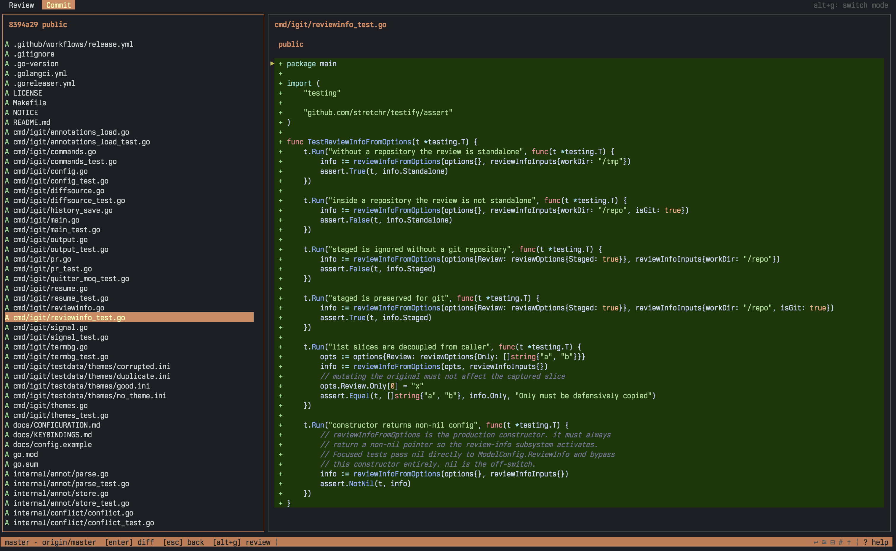

# igit

Getting a change in has two halves: reading it, and shipping it. Most tools do
one of them. igit does both, in the terminal, in one binary.

**Review mode** walks a diff the way a reviewer does, one file and one line at
a time, and lets you leave comments right on the lines. **Commit mode** is the
other half: stage files, hunks or single lines, write the commit, switch
branches, stash, push. `alt+g` (option+g), or a click on the top bar, moves
between them, and the notes you left while reviewing can turn into staged
changes with one key.

One config file, one set of key bindings, no context switch.



## Features

|                             |                                                                                                                     |
|-----------------------------|---------------------------------------------------------------------------------------------------------------------|
| **Two modes, one binary**   | Read a change, then stage and commit it without leaving the app                                                     |
| **Inline annotations**      | Comment on a line, a range or a whole file. Comments go to stdout on exit, so a script or an agent can pick them up |
| **Pull and merge requests** | `igit pr 123` reviews a GitHub PR or a GitLab MR in the terminal and posts one review when you quit                 |
| **Line-level staging**      | Stage a single line, a change block or a visual range, on either side of the index                                  |
| **Marks become commits**    | Mark blocks while reviewing, press `c`, and commit mode opens with exactly those changes staged                     |
| **Merge conflicts**         | Conflicted files get their own section. Settle a whole file, or one conflict block at a time                        |
| **Branches, log, stash**    | Side pane tabs for checkout, merge, rename, history and stash, each entry with its full diff                        |
| **Sync**                    | Push, pull and fetch run interactively, so credential and GPG prompts reach the terminal                            |
| **Reading aids**            | Syntax highlighting, word diff, blame gutter, line numbers, collapsed and compact views, search, wrapping           |
| **Resumable reviews**       | Every session with annotations is saved per scope. `--resume` picks it back up, `igit pr 123` finds its own draft   |
| **Files without a repo**    | `--only` reviews plain files outside any git repository                                                             |
| **Themes**                  | Eight built in, light/dark auto-detection, per-color overrides, `T` switches at runtime                             |
| **Your keys**               | Every action is rebindable, separately for each mode                                                                |
| **Mouse**                   | The wheel scrolls the pane under the pointer, a click selects                                                       |
| **Self-update**             | `igit update --check` tells you if a release is newer, `igit update` installs it                                    |

## Install

Homebrew, on macOS:

```
brew install --cask yousysadmin/apps/igit
```

The install script, on macOS and Linux. It grabs the release binary for your
platform, verifies its checksum and drops it in `~/.local/bin` (`-b DIR` picks
another directory, a trailing tag picks another version):

```
curl -sSfL https://raw.githubusercontent.com/yousysadmin/igit/master/scripts/install.sh | sh
```

From source:

```
go install github.com/yousysadmin/igit/cmd/igit@latest
```

Or `make build`, which leaves the binary in `bin/`. Requires git.

Once installed, igit keeps itself current:

```
igit update --check   # is there a newer release?
igit update           # download it and replace this binary
```

`update` reads the latest GitHub release, checks the archive against the
published sha256 sums and swaps the running binary for the new one. A build
installed by Homebrew is better upgraded with `brew upgrade --cask igit`, and
`igit update` says so when it cannot write where the binary lives.

## Getting started

```
igit                      # what you have changed but not staged
igit --staged             # what is staged
igit HEAD~3               # a ref against the working tree
igit main feature         # two refs
igit commit               # start in commit mode
igit pr 123               # review pull request 123 and post the review on quit
igit pr                   # the request of the current branch, or a picker of open ones
```

Press `?` for the keys of the mode you are in ([full list](docs/KEYBINDINGS.md)).
The mouse works everywhere: the wheel scrolls whatever is under the pointer, a
click picks a file, a list entry or a diff line.

## Review mode

Files on the left, diff on the right. Untracked files are in the list too (`u` hides them, `--tracked-only` starts
without them), `t` hides the whole
pane.

Leave a comment with `a` or `enter` on a line, `A` for the whole file, or start
the comment with the word `hunk` to cover a range of lines. The editor is
multi-line: `alt+enter` breaks a line and the box grows with the text, `enter`
saves, `ctrl+e` hands the text to `$EDITOR`. `@` lists everything you wrote,
`}` and `{` walk the notes across files. `e` opens the current file in
`$EDITOR` from either pane, so a one-line fix does not need a trip through
commit mode.

When you quit, the annotations are printed to stdout, or written to a file
(see [Keeping the results](#keeping-the-results)).

### Marking changes for the commit

| key | action                                                                                           |
|-----|--------------------------------------------------------------------------------------------------|
| `s` | mark the change block under the cursor, the `V` range, or the whole file when the tree has focus |
| `S` | mark the whole current file                                                                      |
| `V` | start or stop a visual line range                                                                |
| `c` | stage everything marked and open commit mode on the Staged section                               |

Nothing touches the git index until `c`. If a block's diff changed since you
marked it, it is skipped and stays marked, and quitting with marks still
pending asks first.

### Conflicts

Open igit in a tree with an unfinished merge, rebase or cherry-pick and it
starts in commit mode, where that work gets finished, whatever `--mode` says.
A subcommand still names its own mode, and `alt+g` reaches review mode as
always.

A conflicted file sits in its own section of the Files list, marked `UU`, and
its diff is the working tree against your side, so the markers are visible.
`space` on the file offers the whole-file answers: resolved as it stands,
take ours, take theirs. `space` on a single conflict block settles that block
alone, keeping ours, theirs or both, so a file with several conflicts is
decided one at a time. `e` opens it in `$EDITOR` when a block needs a
hand-written merge.

The status bar names the unfinished operation next to the branch, and `M`
aborts or continues it. Unstaging a file you resolved brings its conflict
back, and `u` (unstage all) is refused until the merge is finished or aborted,
because `git reset` would drop the merge state with no way back.

## Commit mode

Side pane tabs: `1` Files, `2` Branches, `3` Log, `4` Stash (`<` and `>`
cycle). `t` hides the pane, as it hides the tree in review mode.

| key                  | Files tab                                                                                         |
|----------------------|---------------------------------------------------------------------------------------------------|
| `space` / `s`        | stage / unstage the file                                                                          |
| `a` / `u`            | stage all / unstage all (only the visible files when `--include`, `--exclude` or `--only` is set) |
| `d`                  | discard changes (menu, then confirmation)                                                         |
| `enter` / `tab`      | focus the diff pane for line staging (`tab` toggles back, as in review mode)                      |
| `I`                  | switch the diff between the unstaged and the staged side                                          |
| `e`                  | open the file in `$EDITOR`                                                                        |
| `c` / `C`            | commit with a message prompt / with `$EDITOR`                                                     |
| `A`                  | amend HEAD, keeping or editing the message                                                        |
| `S`                  | stash menu                                                                                        |
| `P` / `F` / `f`      | push (menu) / pull / fetch, run interactively                                                     |
| `M`                  | abort or continue a merge, rebase or cherry-pick left half-finished                               |
| `n` / `p`, `]` / `[` | next / previous file, next / previous hunk, from either pane                                      |

In the diff pane the keys mirror review mode: `space` stages the cursor line (or unstages it, on the staged side), `s`
the change block, `V` starts a visual
range (`shift+up` and `shift+down` extend it, `v` selects the block), `J` and
`K` scroll, `/` searches with `n` and `N` walking the matches, and `d` discards
the selected worktree lines after a confirmation. Review annotations show up on
the unstaged side, where the line numbers match what you read.

Branches: `enter` checks out, `b` creates, `d` deletes, `r` renames, `m`
merges, `U` sets the upstream. Log and Stash show the complete diff of the
selected entry, each file under its own header and the message under the title.
`enter` drills into the entry's file list, stash `d` drops, `S` pops or applies.

## Reviewing a pull or merge request

```
igit pr [number|url|branch]
igit mr [number|url|branch]
```

Same command, two vocabularies, and either one works on either service. The
service comes from the `origin` remote: a host that mentions `github` means
GitHub, anything else GitLab. `--forge github|gitlab` (or `forge =` in the
config) settles it when the guess is wrong.

You need the [GitHub CLI](https://cli.github.com) (`gh auth login` once) or the
[GitLab CLI](https://gitlab.com/gitlab-org/cli) (`glab auth login`, self-hosted
instances included), and igit has to run inside a clone of the repository. It
resolves the request, fetches its head and base (nothing is checked out) and
reviews the merge base against the head, so blame and the file tree behave as
in any ref review. `e` is off here, because it would open the file as it is on
disk, which is not what the request describes.

Without an argument it takes the request of the current branch, or shows a
filterable list of the open ones. Comments that already exist on the request
are drawn under their lines as `@author: text`, files carrying them are marked
in the tree, and they stay read-only.

On `q` a menu asks what to do, whether or not you left annotations, because a
review that found nothing is still a verdict:

| key | action                                                                  |
|-----|-------------------------------------------------------------------------|
| `c` | post the annotations as a review with the `Comment` verdict             |
| `a` | post them and approve                                                   |
| `r` | post them and request changes                                           |
| `s` | quit without posting, annotations still go to stdout or the output file |

With nothing annotated the menu keeps `a` and `r` and drops `c`, which both
services reject when there is neither a body nor a comment to carry.

Every annotation becomes a line comment on the right side (added and context
lines) or the left side (removed lines). Whole-file notes, and lines outside
the request's diff that neither service can anchor, are listed in the review
body with their `path:line`. igit creates one review, so reviewers get one
notification: through the reviews endpoint on GitHub, as draft notes published
together on GitLab. A failed post shows the error and keeps the session open,
and the review URL is printed on stderr after exit.

`hunk` annotations become multi-line comments on GitHub. GitLab anchors them on
the first line of the range and names the range in the text. Requesting changes
needs GitLab 17.0 or newer, older instances get a menu without that entry, and
since only a reviewer may request changes, igit adds you to the reviewers
first when you are not one yet, exactly as the web UI does.

## Keeping the results

Annotations go to stdout when you quit. To keep a copy:

- `-o FILE` / `--output FILE` writes them to `FILE` instead of stdout
- `--output-dir DIR` (config key `output-dir`, `IGIT_OUTPUT_DIR`) drops a
  timestamped `<repo>-<time>.md` into `DIR` on exit and still prints to stdout
- `ctrl+s` in the TUI opens a save-as prompt prefilled with the effective path,
  `O` re-flushes to the last chosen file at any time

Beyond that, every session with annotations is saved to the history on its own,
one file per review scope:

```
~/.config/igit/history/<repo>/worktree.md
~/.config/igit/history/<repo>/ref-main..feature.md
~/.config/igit/history/<repo>/pr-123.md
```

Each file holds a header (path, ref, commit, request), the annotations, and the
diff as it was. It is rewritten only when the annotations changed and removed
when a session ends without any, and `--history-max` (20 scopes per repository
by default, 0 turns the history off) prunes the oldest.

`igit pr 123` picks its own draft up automatically. Everywhere else
`igit --resume` continues the entry for the current scope, or offers the
repository's other entries in a picker. A saved commit that no longer matches
HEAD only warns, and annotations whose lines are gone are dropped, the same way
`--annotations` handles them.

## Options

`igit --help` lists every flag. They are grouped by where they apply, and the
config file uses those group names as `[section]` headers.

| group               | applies to  | flags                                                                                                                                                                                                                                                                                      |
|---------------------|-------------|--------------------------------------------------------------------------------------------------------------------------------------------------------------------------------------------------------------------------------------------------------------------------------------------|
| Application Options | both modes  | `--mode`, `--forge`, `--include` / `--exclude` (file scope of the tree and of the Files tab), `--theme`, `--auto-theme-*`, `--chroma-style`, theme management, `--keys`, `--config`                                                                                                        |
| Display Options     | both modes  | `--tree-width` (side pane width in tenths of the window, 2 in review and 3 in commit), `--no-tree`, `--tab-width`, `--wrap`, `--wrap-indent`, `--page-overlap`, `--line-numbers`, `--word-diff`, `--cross-file-hunks`, `--start-at-change`, `--no-colors`, `--no-mouse`, `--no-status-bar` |
| Review Options      | review mode | what to review (`--staged`, `--tracked-only`, `--only`), the view (`--collapsed`, `--compact`, `--compact-context`, `--blame`), annotations and output (`--annotations`, `--resume`, `--annotation-marker`, `--output`, `--output-dir`, `--history-dir`, `--history-max`), confirmations   |
| Commit Options      | commit mode | `--log-diff-files`, `--no-verify` (skip pre-commit and commit-msg hooks), `--signoff` (add a `Signed-off-by` trailer)                                                                                                                                                                      |
| Color Options       | both modes  | `--color-*` overrides of the active theme                                                                                                                                                                                                                                                  |

Commit mode needs a git working tree, so it is off when you review standalone
files or a pull request. That is intent, not a gap: a request review describes
a change on the server, not the files on your disk. The in-session toggle says
so, and a `--mode commit` coming from an alias or the config file falls back to
review mode instead of refusing to start.

### About `shift+enter`

igit cannot bind it, because no escape sequence of its own reaches the
application. It still works in terminals that send `\x1b\r` for it, which is
what `alt+enter` is. To see what yours sends, run `stty -icanon -echo`, then
`cat -v`, press the chord, read the output, and finish with Ctrl+C and
`stty sane`. `^[^M` is `alt+enter` and works as is. A bare `^M` is plain
`enter` and needs a terminal-side mapping to `\x1b\r`.

## Configuration

Every flag, environment variable and config key is listed in
[docs/CONFIGURATION.md](docs/CONFIGURATION.md).

`~/.config/igit/config` is an INI file keyed by the long flag names under the
group headers above, and `igit --dump-config` prints every option with its
default and section. Environment variables take the `IGIT_` prefix.

Themes live in `~/.config/igit/themes/` (`--list-themes`, `--theme NAME`, or
`T` in either mode, and a theme picked in one mode applies to both). Key
bindings live in `~/.config/igit/keybindings` as `map <key> <action>` lines,
with a `commit:` prefix on the key for the commit-mode map. `igit --dump-keys`
prints both.
